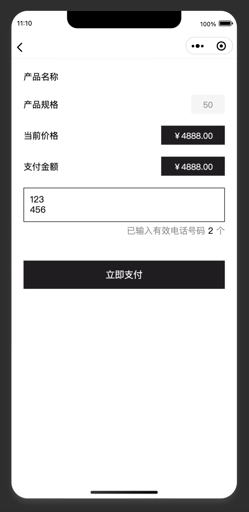
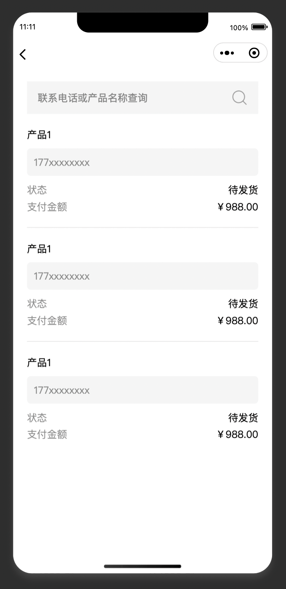
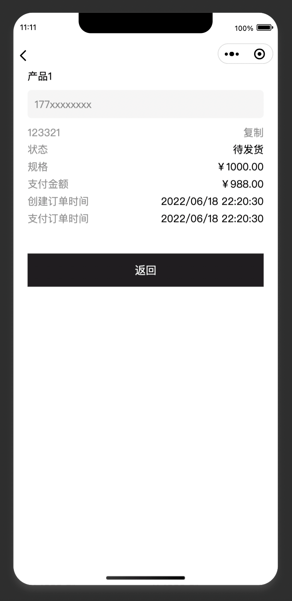
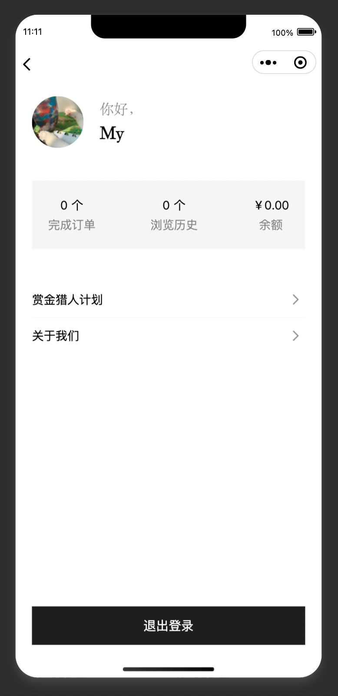

<!--
 * @Descripttion: your project
 * @version: 0.0.0
 * @Author: Minyoung
 * @Date: 2022-06-06 11:08:57
 * @LastEditors: Minyoung
 * @LastEditTime: 2022-06-06 13:08:47
-->
# Taro + 云开发 实现一个简易小商城
## 页面
<div style="display:flex;flex-wrap:wrap;">
  
  
  
  
  
  
</div>

## 云开发（免费方案）
⚠️使用云开发必须使用正式的appid  
使用到的功能
+ 云函数: 用于产品列表数据的展示
+ 存储: 存储图片
### 云开发配置
1. 在根目录`project.config.json`中配置:
  ```json
  // 注明云函数文件夹
  "cloudfunctionRoot": "cloudbase/"
  ```
2. 将云函数打包到小程序运行目录  
  2.1 在配置文件`config/index.js`中配置：
  ```js
  copy: {
    patterns: [
      { from: 'cloudbase', to: 'dist/cloudbase' }
    ],
    options: {
    }
  },
  ```
# 相关链接
+ <a href="https://taro-docs.jd.com/taro/docs/" target="_blank">Taro开发文档</a>  
+ <a href="https://s.juejin.cn/ds/Ye4SSem/" target="_blank">Taro 多端开发实现原理与项目实战 —— 凹凸实验室出品（京东）</a>
+ <a href="https://developers.weixin.qq.com/miniprogram/dev/framework/" target="_blank">微信小程序开发指南</a>
# 